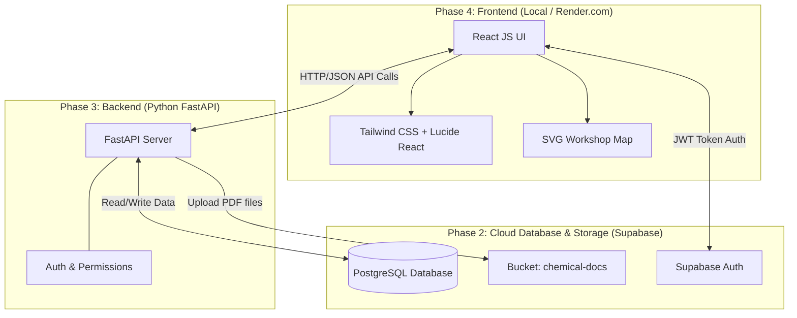
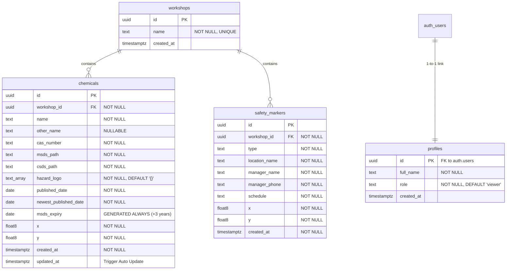
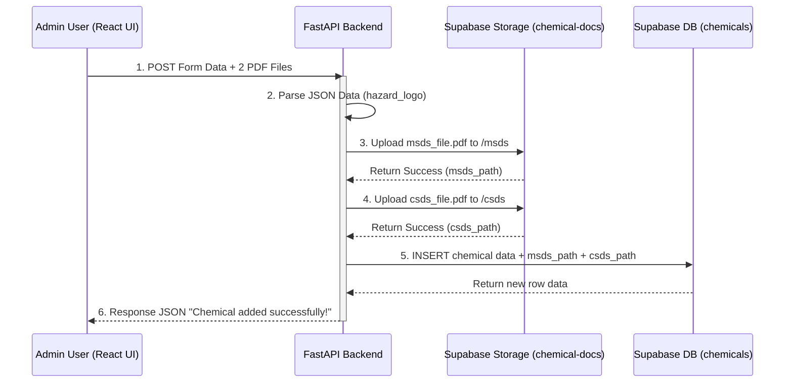
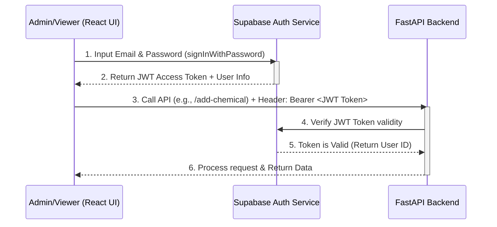
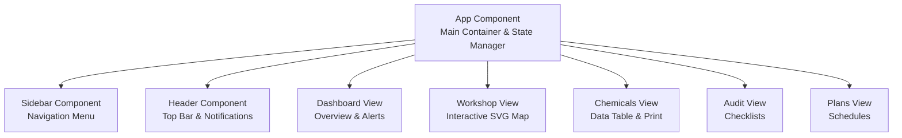

# TREMON - HSE - Industrial Safety Management Dashboard

## 📖 Project Overview
**TREMON - HSE** is a modern, minimalist Internal Dashboard built for factory safety management. Designed with a "Database-First" approach, it digitizes the tracking of chemical documents (MSDS/CSDS), automated expiry alerts, and safety markers (fire extinguishers, emergency exits) across multiple workshops.

## ✨ Key Features
*   **Chemical & Document Management**: Tracks global `cas_number`, auto-calculates `msds_expiry` (+3 years from the published date), and manages `hazard_logo` GHS pictograms using array data types.
*   **Direct Cloud Storage**: Directly uploads and serves PDF documents via Supabase Storage (`chemical-docs` bucket).
*   **Interactive SVG Map & Clustering**: Visualizes safety markers and chemical locations using specific `x` and `y` coordinates. Automatically clusters multiple chemicals at the same location into a "Folder" icon.
*   **Role-Based Access Control (RBAC)**: Secure access using Supabase Auth. Only Admin users can upload files or modify chemical and safety data.

## 🛠 Tech Stack
*   **Frontend**: React JS, Vite, Tailwind CSS, Lucide React.
*   **Backend**: Python, FastAPI, Uvicorn.
*   **Database & Storage**: Supabase (PostgreSQL), Supabase Auth, Supabase Storage.
*   **Deployment**: GitHub, Render.com.

---

## 📐 System Architecture Diagrams

### 1. System Architecture Diagram
This diagram illustrates the 3-Tier Architecture of the application.

### 2. Entity-Relationship Diagram (ERD)
The core database schema featuring strict `NOT NULL` constraints, isolated `x` and `y` coordinates, and automated timestamps.

### 3. Data Flow Diagram (Upload Flow)
The sequence of adding a new chemical, parsing the `hazard_logo` array, uploading PDFs to the `chemical-docs` bucket, and inserting data.

### 4. Authentication Flow
The security mechanism using Supabase Auth JWT Tokens to protect the API endpoints.

### 5. Frontend React Component Tree
The Component-Based Architecture splitting the UI into manageable views.

---

